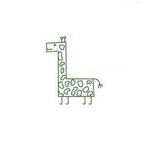
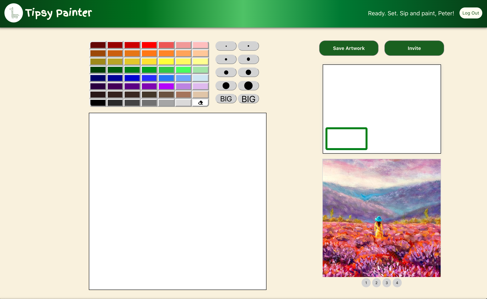
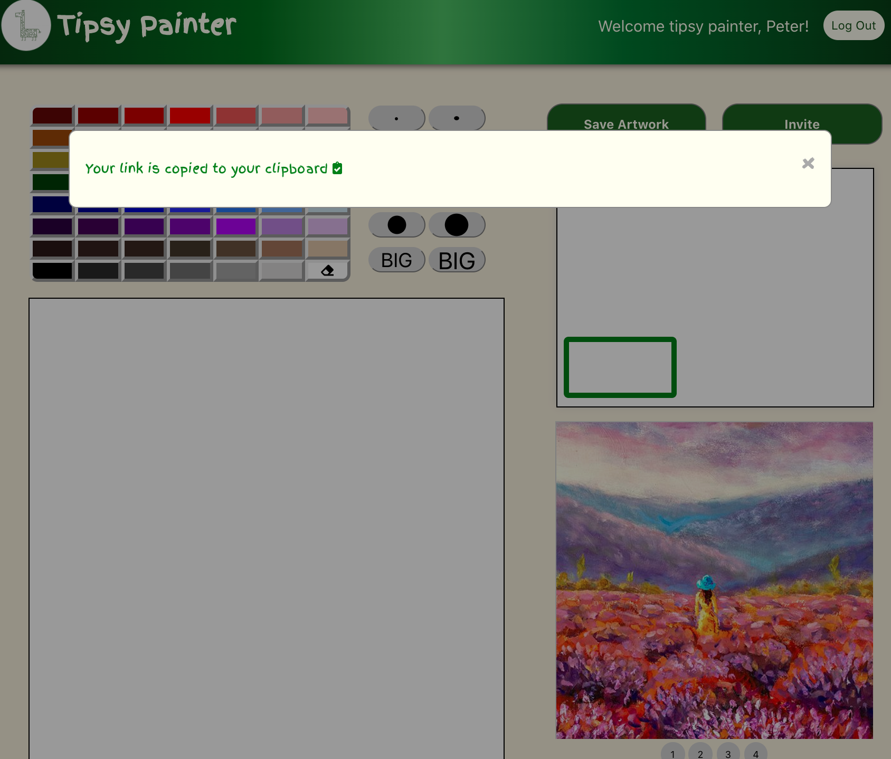
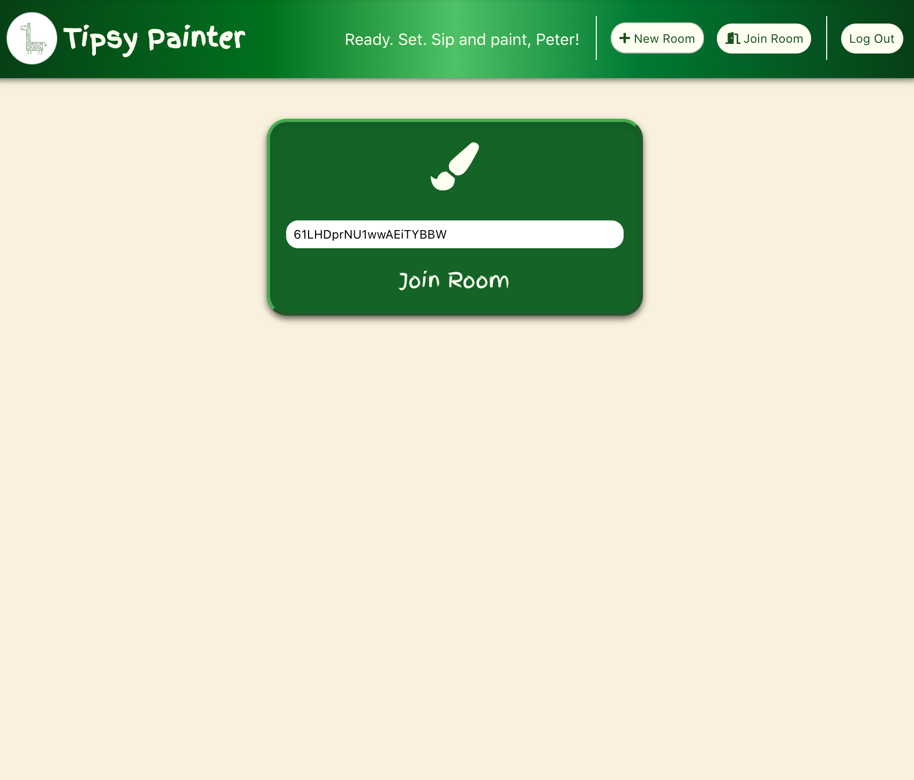
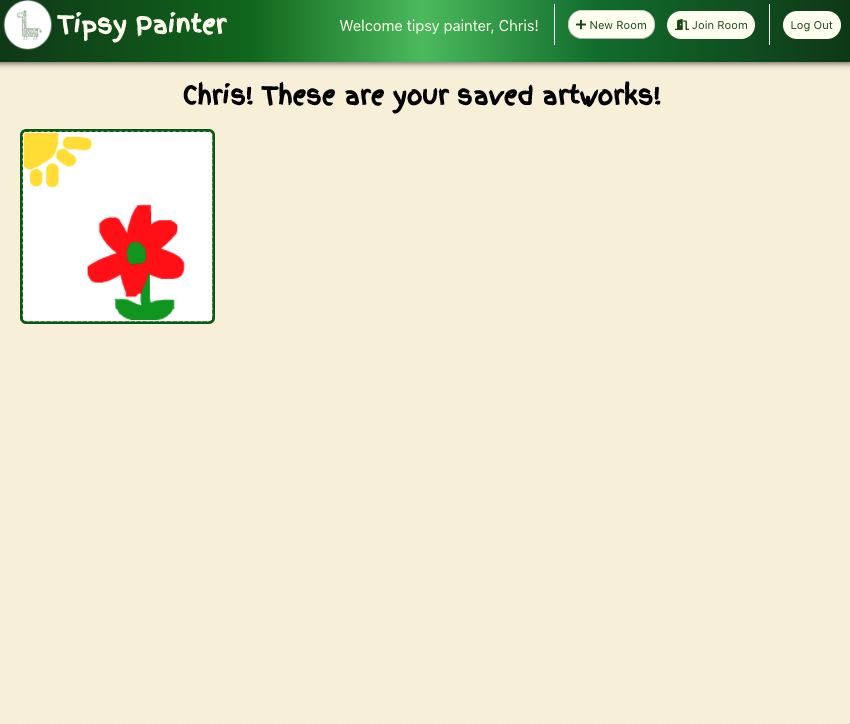

# Welcome to Tipsy Painter

Tipsy Painter is a collaborative drawing website where you can draw with friends and get tipsy together.

## [Live Link](https://tipsypainter.herokuapp.com/#/)

## Technologies

Tipsy Painter was built using:

* Front End
     * React
     * CSS/HTML

* Back End
     * MongoDB (mongoose 5.9.9)
     * Express 4.17.1
     * Node.js 10.13.0
     * Web Socket API (socket.io 2.3.0)
     
## Background and Overview

Tipsy Painter takes the popular format of sip-and-paint parties to the digital canvas. Multiple users can paint together on the same canvas remotely.



## Features

* User authentication

Tipsy Painter has backend user auth and persistent user state. 

* Responsive canvas that updates for more than one user.

Implemented with socket.io and created functions for sending out and receiving the canvas data inside of canvas components so that multiple users can draw together at the same time.

For sending out the canvas data;

```javascript
 this.socket.emit("draw", this.props.match.params.id, {
      x: x,
      y: y,
      color: this.state.color,
      lineWidth: this.state.lineWidth,
      lineCap: this.state.lineCap,
    });
```

For receiving the canvas data;
```javascript
receiveDraw(x, y, color, lineWidth, lineCap) {
    const ctx = this.getContext();
    ctx.lineTo(x, y);
    ctx.stroke();
    ctx.strokeStyle = color;
    ctx.lineWidth = lineWidth;
    ctx.lineCap = lineCap;
  }
```


* Create and Join Art Rooms

Once a user clicks ```invite button``` in a room, it fires off a function called ```handleInvite``` .
Inside of ```handleInvite```, it will look for a DOM document objects and copy URL to the clipboard on the client side. 

```javascript
  handleInvite() {
    const el = document.createElement('textarea');
    el.value = window.location.origin + `/#/join?roomtoken=${this.props.room[0].room_token}`;
    document.body.appendChild(el);
    el.select();
    document.execCommand('copy');
    document.body.removeChild(el);
    ... 
    }
   ....
  }
```

 


* Room Token

When a user pastes sharable URL, it auto-fills ```room token```. 
After the first render occurs on the client side, one of React Lifecycle Methods, ```componentDidMount``` will handle taking out the room token out of URL's query params, and setting the room token as a state in that component. 

```javascript 
  componentDidMount() {
    let queryParams = new URLSearchParams(this.props.location.search)
    let roomtoken = queryParams.get("roomtoken")
    if (roomtoken) {
      return this.setState({ room_token: roomtoken })
    }
  }
 ```
 
 

* Save Artworks

Once a user clicks ```save artwork``` button, they can save their artwork on their own gallery page. The button has an onClick listener that fires the handleSaveArtWork function, which checks the current user ID, converts the canvas to a data URL and saves the artwork to the curret user's gallery.

```javascript 
  <div className="save-artwork-button" onClick={() => this.handleSaveArtwork()}>Save Artwork</div>
```

```javascript 

  handleSaveArtwork() {
    if (typeof this.props.currentUser.id !== "undefined") {
      const dataUrl = this.refs.canvas.toDataURL();
      this.props.saveArtwork({
        userId: this.props.currentUser.id,
        dataUrl: dataUrl,
      })
      ... 
  }
 ```





